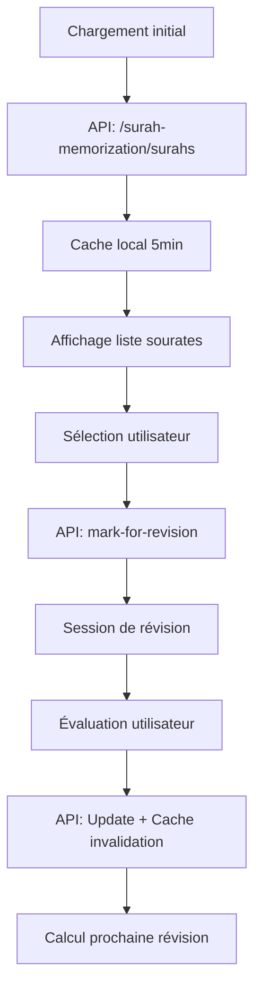

# 📚 Système de Mémorisation des Sourates

## 🎯 **Vue d'ensemble**

Le système de mémorisation des sourates est une application complète permettant aux utilisateurs de gérer l'apprentissage et la révision des sourates du Coran selon la méthode de **répétition espacée**. Cette technique optimise la mémorisation en programmant les révisions à des intervalles calculés selon la performance de l'utilisateur.

## 🔧 **Fonctionnalités principales**

### 📋 **1. Sélection des sourates**

- **Liste interactive** de toutes les sourates avec informations détaillées
- **Recherche dynamique** par nom ou numéro de sourate
- **Filtres avancés** : par niveau de mémorisation, ordre alphabétique, numérique
- **Sélection rapide** :
  - Sourates en retard de révision ⏰
  - Sourates par niveau de mémorisation 📊
  - Sélection/désélection totale ☑️❌

### 🔄 **2. Système de révision**

- **Ordre aléatoire** pour éviter la mémorisation séquentielle
- **Affichage du texte arabe** en option
- **Évaluation sur 4 niveaux** :
  - **Fort** (Strong) - Prochaine révision : 30 jours
  - **Bon** (Good) - Prochaine révision : 14 jours
  - **Moyen** (Moderate) - Prochaine révision : 7 jours
  - **Faible** (Weak) - Prochaine révision : 3 jours

### 📊 **3. Historique et statistiques**

- **Graphiques visuels** de distribution des niveaux de mémorisation
- **Tableau détaillé** des révisions avec dates et niveaux
- **Filtrage** de l'historique par niveau
- **Export CSV** des données de révision
- **Effacement complet** de l'historique

## ⚙️ **Architecture technique**

### 🗂️ **Structure des fichiers**

```
Front-End/components/quran/
├── README.md                    # Cette documentation
├── surahMemorization.js         # Logique principale
├── surahSelector.js             # Sélecteur pour la Salat
└── [Fichiers CSS associés]
```

### 🔄 **Flux de données**



### 🎛️ **Variables globales**

```javascript
// Protection contre initialisations multiples
let isInitialized = false;
let isLoading = false;

// Données principales
let allSurahs = []; // Toutes les sourates
let surahsInRevision = []; // Sourates de la session actuelle
let currentSurahIndex = 0; // Index courant dans la session

// Cache optimisé (5 minutes)
let dataCache = {
  surahs: null,
  history: null,
  lastSurahsFetch: 0,
  lastHistoryFetch: 0,
  CACHE_DURATION: 5 * 60 * 1000,
};
```

## 📡 **API Endpoints**

### **GET** `/surah-memorization/surahs`

Récupère toutes les sourates avec leurs statuts de mémorisation

```json
{
  "surahs": [
    {
      "number": 1,
      "name": "Al-Fatihah",
      "arabic": "الفاتحة",
      "memorizationLevel": "Strong",
      "lastRevisionDate": "2024-01-15",
      "nextRevisionDate": "2024-02-14",
      "isAvailableForRevision": true
    }
  ]
}
```

### **POST** `/surah-memorization/surahs/mark-for-revision`

Marque des sourates pour révision

```json
{
  "sourates": [1, 2, 3, 114]
}
```

### **POST** `/surah-memorization/surahs/:number`

Met à jour le niveau de mémorisation d'une sourate

```json
{
  "memorizationLevel": "Good",
  "lastRevisionDate": "2024-01-20"
}
```

### **GET** `/surah-memorization/history`

Récupère l'historique des révisions

```json
{
  "history": [
    {
      "name": "Al-Fatihah",
      "number": 1,
      "lastRevisionDate": "2024-01-20",
      "memorizationLevel": "Strong",
      "nextRevisionDate": "2024-02-19"
    }
  ]
}
```

### **DELETE** `/surah-memorization/history`

Efface complètement l'historique des révisions

## 🔒 **Système de sécurité**

### **Authentification**

- Token JWT requis pour tous les endpoints
- Middleware `authenticateToken` sur toutes les routes
- Isolation des données par `user_id`

### **Validation des données**

- Vérification des types (`parseInt` pour les numéros)
- Validation des niveaux de mémorisation
- Protection contre les injections SQL via requêtes paramétrées

## 🚀 **Optimisations de performance**

### **1. Cache intelligent**

```javascript
// Vérification du cache avant appel API
if (dataCache.surahs && now - dataCache.lastSurahsFetch < CACHE_DURATION) {
  console.log("📄 Utilisation du cache pour les sourates");
  // Utilise les données en cache
} else {
  // Nouvel appel API + mise à jour du cache
}
```

### **2. Élimination de code dupliqué**

- Fonction `createSurahElement()` réutilisable
- Réduction de ~40 lignes de code dupliqué
- Maintenance simplifiée

### **3. Gestion mémoire optimisée**

- Nettoyage automatique des event listeners
- Destruction des graphiques Chart.js
- Invalidation ciblée du cache

## 🎨 **Interface utilisateur**

### **Navigation à onglets**

- **Sélectionner Sourate** : Choix des sourates à réviser
- **Réviser** : Session de révision interactive
- **Historique** : Statistiques et données de révision

### **Indicateurs visuels**

- **EN RETARD** - Sourates en retard de révision avec bordure rouge
- **Niveaux colorés** - Strong (vert), Good (bleu), Moderate (jaune), Weak (rouge)
- **Barre de progression** - Gradient bleu pour le suivi de session

### **Boutons de sélection rapide**

```html
<!-- Sélection intelligente basée sur les données -->
<button id="select-due-surahs">Sourates en retard (X)</button>
<button id="select-by-level">Par niveau</button>
<button id="select-all-surahs">Tout sélectionner</button>
<button id="clear-all-surahs">Tout désélectionner</button>
```

## 🔮 **Algorithme de répétition espacée**

### **Calcul des intervalles** (côté backend)

```sql
-- Calcul de la prochaine date de révision
CASE
  WHEN memorization_level = 'Strong' THEN last_revision_date + INTERVAL '30 days'
  WHEN memorization_level = 'Good' THEN last_revision_date + INTERVAL '14 days'
  WHEN memorization_level = 'Moderate' THEN last_revision_date + INTERVAL '7 days'
  WHEN memorization_level = 'Weak' THEN last_revision_date + INTERVAL '3 days'
  ELSE last_revision_date + INTERVAL '1 day'
END
```

### **Priorisation des sourates**

1. **Sourates en retard** (dépassé la date de révision)
2. **Sourates jamais révisées** (priorité haute)
3. **Tri par niveau** (Weak > Moderate > Good > Strong)
4. **Randomisation** pour éviter les patterns

## 🐛 **Debugging et logs**

### **Système de logs visuels**

```javascript
console.log("📄 Utilisation du cache"); // Cache hit
console.log("🔄 Chargement depuis l'API"); // API call
console.log("✅ Données chargées"); // Success
console.log("❌ Erreur détectée"); // Error
console.log("🗑️ Invalidation du cache"); // Cache clear
```

### **Protection contre les bugs**

- Vérification d'initialisation multiple
- Gestion des éléments DOM manquants
- Try-catch sur tous les appels API
- Nettoyage préventif des event listeners

## 🛠️ **Maintenance et développement**

### **Points d'attention**

1. **Ordre des routes Express** : Routes spécifiques avant paramètres dynamiques
2. **Nettoyage mémoire** : Toujours appeler `cleanupSurahMemorization()`
3. **Cache invalidation** : Après toute modification de données
4. **Event listeners** : Nettoyage avant réattachement

### **Tests recommandés**

- Navigation entre onglets sans fuite mémoire
- Gestion des erreurs réseau
- Validation des données utilisateur
- Performance avec grande quantité de sourates

## 📱 **Compatibilité**

- **Navigateurs** : Chrome, Firefox, Safari, Edge (modernes)
- **Mobile** : Interface responsive
- **Dépendances** : Chart.js pour les graphiques
- **API** : RESTful avec authentification JWT

---

_Ce système utilise les meilleures pratiques de développement web moderne avec une architecture modulaire, un cache intelligent et une gestion optimisée de la mémoire pour offrir une expérience utilisateur fluide et performante._
